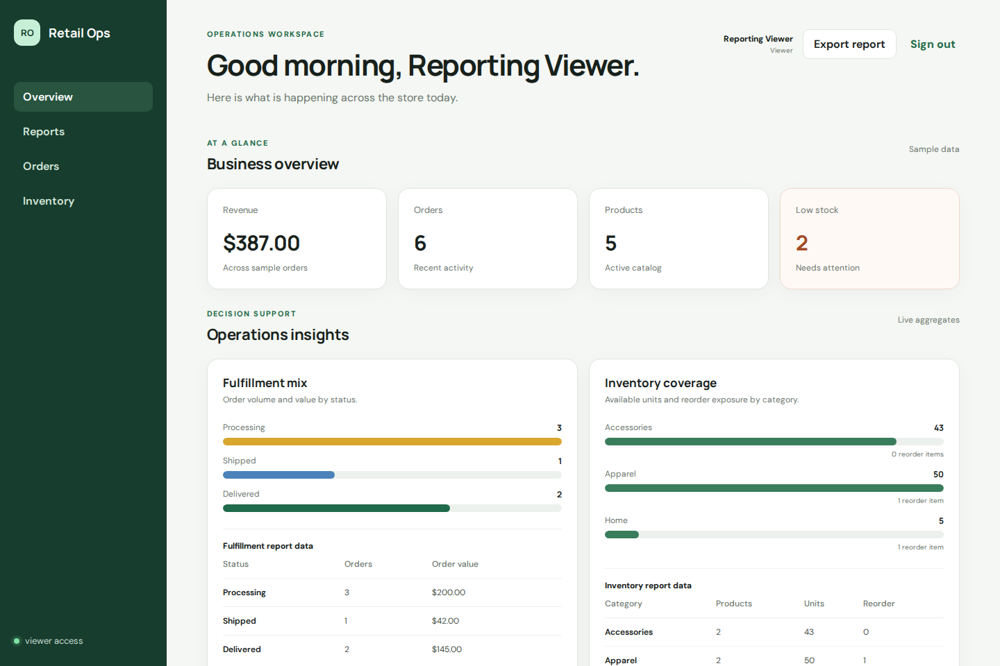
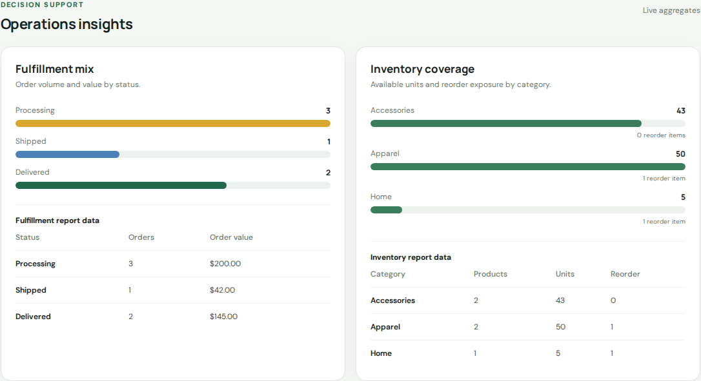

# Retail Operations Dashboard

A portfolio-grade full-stack dashboard for monitoring retail orders, revenue, products, and inventory risk. It connects Edward Rangel's real-world background in software engineering, e-commerce, and retail operations with a modern TypeScript stack.

> All names, orders, products, and financial values in this repository are fictional demonstration data.

## Live demo

[Open the Retail Operations Dashboard](https://retail-operations-dashboard.onrender.com) to explore the production deployment.

## Why this project

This project is designed to demonstrate more than isolated framework knowledge. It models a practical business workflow and shows how a frontend, API, database, container environment, and technical documentation fit together.

## Current MVP

- Executive summary for revenue, orders, products, and low-stock items
- Recent-order monitoring with fulfillment statuses
- Inventory watch list with reorder indicators
- REST API backed by PostgreSQL
- Responsive React interface
- Reproducible local environment with Docker Compose
- Seeded, fictional retail data
- PostgreSQL-backed login sessions and role-based order permissions
- Accessible operations charts with equivalent reporting tables
- Playwright end-to-end coverage for authentication, navigation, and filters

## Product preview

[](https://retail-operations-dashboard.onrender.com)

The authenticated overview presents operational KPIs, fulfillment activity, inventory risk, and production reporting in one responsive workspace.



## Tech stack

- **Frontend:** React, TypeScript, Vite, responsive CSS
- **Backend:** Node.js, Express, TypeScript
- **Database:** PostgreSQL
- **Infrastructure:** Docker, Docker Compose, Nginx
- **Package management:** pnpm workspaces
- **Testing:** Vitest, Testing Library, Playwright
- **CI/CD:** GitHub Actions, Render

## Architecture

```text
Browser
  │
  ▼
React + TypeScript frontend
  │  REST/JSON
  ▼
Express + TypeScript API
  │  SQL
  ▼
PostgreSQL
```

## Run with Docker

### Prerequisites

- Docker Desktop or Docker Engine with Docker Compose

### Start the complete application

```bash
docker compose up --build
```

Then open:

- Dashboard: `http://localhost:8080`
- API health check: `http://localhost:4000/api/health`

### Demo accounts

| Role | Email | Password | Access |
| --- | --- | --- | --- |
| Operator | `operator@retail.local` | `RetailOps!2026` | Local development only; read, export, create orders, update fulfillment |
| Viewer | `viewer@retail.local` | `RetailView!2026` | Local and public demo; read and export only |

These credentials are fictional. Operator sign-in and order mutations are disabled in the public deployment.

Stop the environment with:

```bash
docker compose down
```

## Run for development

### Prerequisites

- Node.js 22.23.2 (see `.nvmrc`)
- Corepack with pnpm 10.15.0
- PostgreSQL 16+

```bash
corepack enable
pnpm install --frozen-lockfile
pnpm dev
```

The frontend runs on `http://localhost:5173` and the API on `http://localhost:4000`.

## End-to-end tests

The Playwright suite exercises the real Docker Compose stack, including PostgreSQL, login sessions, navigation, and server-backed filters.

```bash
pnpm exec playwright install --with-deps chromium
pnpm test:e2e
```

Playwright reuses an existing application at `http://localhost:8080` or starts `docker compose up --build` and waits for it automatically. GitHub Actions runs the Chromium project after typecheck, unit tests, builds, and the production-image build pass.

### Supply-chain controls

- The committed pnpm lockfile is installed with `--frozen-lockfile` locally, in Docker, and in CI.
- A root override keeps `nanoid` at the patched `3.3.18` release required by the current Vite/PostCSS dependency path.
- Every external GitHub Action is pinned to a verified full commit SHA; its release tag remains in an inline comment so Dependabot can maintain it.
- `.github/dependabot.yml` checks pnpm/npm dependencies, Docker base-image digests, and GitHub Actions every Monday. Dependabot PRs still require the normal review and successful CI before merge.
- GitHub's dependency alerts and automatic security-update setting must remain enabled for the repository; neither setting authorizes automatic merging.

Refresh the README screenshots from the public viewer experience with:

```bash
pnpm screenshots
```

## Repository structure

```text
retail-operations-dashboard/
├── .github/workflows/ # Continuous integration
├── apps/
│   ├── api/          # Express REST API
│   └── web/          # React dashboard
├── database/         # Production-safe schema/demo data and local-only operator seed
├── docs/images/      # README product screenshots
├── e2e/              # Playwright browser tests
├── scripts/          # Repeatable maintenance scripts
├── docker-compose.yml
├── Dockerfile        # Reproducible multi-stage production and local targets
└── README.md
```

## API endpoints

| Method | Endpoint | Purpose |
| --- | --- | --- |
| GET | `/api/health` | Public API and database health |
| POST | `/api/auth/login` | Create an HTTP-only database session |
| GET | `/api/auth/me` | Return the authenticated user |
| POST | `/api/auth/logout` | Revoke the current session |
| GET | `/api/dashboard` | Authenticated summary metrics |
| GET | `/api/reports/operations` | Fulfillment and inventory reporting aggregates |
| GET | `/api/products` | Filtered and paginated inventory data |
| GET | `/api/orders` | Filtered and paginated orders |
| POST | `/api/orders` | Create a validated order |
| PATCH | `/api/orders/:id` | Update fulfillment status |

Dashboard, product, order, and current-user endpoints require an active session. Logout remains idempotent when no session exists. Order creation and fulfillment updates additionally require the `operator` role.

### Authentication design

- Passwords are stored as salted `scrypt` hashes; plaintext passwords are never stored.
- Session tokens are random, returned only in an `HttpOnly` and `SameSite=Lax` cookie, and stored in PostgreSQL only as SHA-256 hashes.
- Sessions expire after eight hours, concurrent sessions remain independent, and sign-in removes only expired sessions; logout revokes the current session server-side.
- CORS allows credentials only for `WEB_ORIGIN`, Render's own external URL, or the local frontend origin during development.
- Helmet sets production security headers including CSP, HSTS, MIME-sniffing protection, and frame restrictions; Express does not expose `X-Powered-By`.
- Layered rate limits protect the complete API, sign-in, public health checks, authenticated reads, reports, and order mutations.
- Security-relevant authentication, authorization, rate-limit, and server-error events are emitted as structured JSON without raw credentials, cookies, tokens, email addresses, client addresses, query strings, or exception messages.
- Production initialization removes the known local operator account, and the production image does not contain its credential seed.
- The public deployment also disables operator sign-in and all order mutations as a second defensive layer.
- Local Docker uses HTTP and therefore sets `COOKIE_SECURE=false`; an HTTPS deployment must set `COOKIE_SECURE=true`.
- This portfolio implementation does not include account recovery, MFA, or an external identity provider.

### Rate limiting policy

| Scope | Limit per client address |
| --- | --- |
| All `/api` requests | 300 per minute |
| Public `/api/health` checks | 60 per minute |
| Sign-in attempts, successful or failed | 10 every 15 minutes |
| Authenticated `GET` and `HEAD` requests | 120 per minute |
| Operations report requests | 30 per minute |
| Order creation and status changes | 30 per minute |

Applicable limits are cumulative: an authenticated report request consumes the global, authenticated-read, and report counters. Responses expose standard draft-8 `RateLimit` headers. Render traffic is attributed to the originating client through the configured trusted proxy hop. Counters currently use the process-local memory store, which is appropriate for the single free Render instance but resets whenever the process restarts and is not shared across multiple instances.

### Security monitoring

The API writes one-line JSON security events to the existing process output captured by Docker and Render. The event catalog covers:

- invalid login payloads and credentials;
- blocked attempts to use the local-only operator account or operator mutations in production;
- invalid or expired session cookies;
- role-based authorization denials;
- the first rate-limit rejection for each client, limiter, and window, which signals abnormal request volume without creating an unbounded log stream;
- unexpected request-processing errors, reduced to the error type and safe machine-readable code.

Every event includes a timestamp, severity, outcome, HTTP status, method, path, and event-specific control metadata. Account and client identifiers use process-scoped HMAC fingerprints so related activity can be correlated during one runtime without retaining their raw values. The key and fingerprints change whenever the process restarts, matching the lifetime of the current in-memory rate-limit counters.

Inspect local events with `docker compose logs api`. In production, use the existing Render service log view and filter for `"category":"security"`. This implementation does not add a paid monitoring service, persistent security-log archive, automated alert delivery, or cross-instance correlation. Enabling any paid observability product still requires explicit authorization.

### Order number convention

Order numbers must use the exact format `BT-0000`: the uppercase prefix `BT-` followed by exactly four digits. Example: `BT-1049`. The rule is enforced by the form, API, and PostgreSQL for new orders.

### Collection query parameters

- Both collection endpoints accept `page`, `pageSize` (maximum 100), and `search`.
- Orders accept `status=processing|shipped|delivered`.
- Products accept `stock=low|in-stock`.
- Collection responses include `items` plus page, page size, total results, and total pages.

## Production deployment

The dashboard is deployed at [retail-operations-dashboard.onrender.com](https://retail-operations-dashboard.onrender.com) using a Render Free web service and a Neon Free PostgreSQL database. The root production `Dockerfile` installs the pnpm workspace from the committed lockfile, packages React and Express into one same-origin service, excludes test files and the local operator credential seed from the runtime image, and runs Node as the non-privileged `node` user. `render.yaml` records the reproducible Render configuration, fixes the instance to the Free plan, and keeps `DATABASE_URL` out of version control.

Production changes follow this path:

```text
Pull request -> GitHub Actions (`pnpm verify` + Docker build)
             -> merge to `main`
             -> checks pass on `main`
             -> Render deploy
             -> `/api/health` health check
```

Render supplies its external URL to the application at runtime. Production also uses secure cookies, trusts one Render proxy hop, and disables operator sign-in and order mutations for the public demo. Deployment settings and secrets must remain aligned with `render.yaml`; never commit `DATABASE_URL`.

See [the deployment and cost evaluation](docs/deployment-evaluation.md) for the current production status, provider limitations, verification procedure, and cost guardrails.

### Validate the production image locally

```bash
docker build -t retail-operations-dashboard:production .
```

The container listens on port `10000`, serves the dashboard and API from the same origin, and initializes the idempotent fictional schema from `database/init.sql`. That production-safe script deletes any legacy `operator@retail.local` account and seeds only the public viewer. Docker Compose uses the separate `database/local-operator.sql` file after the base initialization so local create/update workflows remain available.

### Verify production

After a deployment, confirm the GitHub Actions run for `main` passed, then verify:

```bash
curl --fail --show-error https://retail-operations-dashboard.onrender.com/api/health
```

The endpoint must return HTTP `200` with `"status":"ok"`. Complete the browser smoke test by signing in as the viewer, checking dashboard data, filters, pagination, charts, and CSV export. Operator sign-in and all order mutations must remain unavailable in the public demo.

## Roadmap

- [x] Full-stack project foundation
- [x] Dashboard, product, and order read models
- [x] PostgreSQL schema and fictional seed data
- [x] Docker Compose environment
- [x] Server-side filtering and pagination
- [x] Create and update order workflows
- [x] Authentication and role-based access
- [x] Unit and integration tests
- [x] Playwright end-to-end tests
- [x] GitHub Actions continuous integration
- [x] Accessible charts and reporting
- [x] Low-cost or zero-cost deployment evaluation

## Data and privacy

This repository does not contain customer information, store credentials, private business data, or production integrations. It is an independent portfolio project built with fictional data.

## License

This project is licensed under the [MIT License](LICENSE). It may be used, copied, modified, and distributed when the copyright and license notice are preserved. The software is provided without warranty.

## Author

[Edward Rangel](https://github.com/ejrangel7) — Senior Full Stack Software Engineer
